# C++ Threading

Table of Context: 
1. [Introduction](#introduction) 
2. [Mutex](#mutex)

    2.1 [Why mutex](#topic-mutex-in-c-threading--why-use-mutex--what-is-race-condition-and-how-to-solve-it--what-is-critical-section)
    
    2.2 [std::mutex::try::lock](#topic-stdmutextry_lock-on-mutex-in-c11-threading) 


# Introduction

Threading concept discussed here are relavent to C++ language. It is different from OS.

## TOPIC: Introduction to thread in c++ (c++11)   00 cpp file

- QUESTIONS
    1. What do you understand by thread and give one example in C++?
- ANSWER

    0. In every application there is a default thread which is main(), in side this we create other threads.
    1. A thread is also known as lightweight process. Idea is to achieve parallelism by dividing a process into multiple threads. 
    For example:
    (a) The browser has multiple tabs that can be different threads. 
    (b) MS Word must be using multiple threads, one thread to format the text, another thread to process inputs (spell checker)
    (c) Visual Studio code editor would be using threading for auto completing the code. (Intellicence)

- WAYS TO CREATE THREADS IN C++11
    1. Function Pointers
    2. Lambda Functions
    3. Functors
    4. Member Functions
    5. Static Member functions 

- Example of Function Pointers using std:thread  -> Check code    


## TOPIC: Different Types Of Thread Creation And Calling. 01 cpp file

There are 5 different types of creating threads in C++11 using **callable Objects**. 

**Note : If we create mulitple threads at the same time it doesn't guarantee which one will start first.**

1. Function Pointer : this is the very basic form of creating threads.


2. Lambda Function


3. Functor (Function Object)  : Class overloading the operator ()


4. Member function (Non_static member function) : Call a class function (non-static) using the class object. 


5. Static member function : Directly call the static memmber function.


## TOPIC: Use Of join(), detach() and joinable() In Thread In C++ (C++11)   02 cpp file

- JOIN NOTES
    
    0. Once a thread is started we wait for this thread to finish by calling join() function on thread object.
    1. Double join will result into program termination.
    2. If needed we should check thread is joinable before joining. ( using joinable() function)


good Cosing practicve : Joinable is a function that is used to check if the thread is joinable.


- DETACH NOTES
    
    0. This is used to detach newly created thread from the parent thread.
    1. Always check before detaching a thread that it is joinable otherwise we may end up double detaching and 
    double detach() will result into program termination.
    2. If we have detached thread and main function is returning then the detached thread execution is suspended.


- NOTES:
 
 Either join() or detach() should be called on thread object, otherwise during thread object's destructor it will 
 terminate the program. Because inside destructor it checks if thread is still joinable() if yes then it terminates the program.


# Mutex

## TOPIC: Mutex In C++ Threading | Why Use Mutex | What Is Race Condition And How To Solve It? | What Is Critical Section

- Mutex: Mutual Exclusion
 
- RACE CONDITION:

    0. Race condition is a situation where two or more threads/process happend to change a common data at the same time.
    1. If there is a race condition then we have to protect it and the protected section is  called critical section/region.

- MUTEX:

    0. Mutex is used to avoid race condition.
    1. We use lock() , unlock() on mutex to avoid race condition.

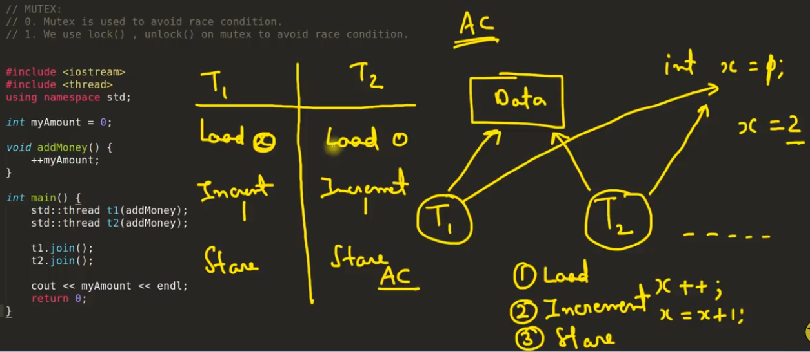

AC means accumulator Register.  In assembly language, for x++ operation internally it is written as 
    
    1. Load x in Acuumulator (AC) register
    2. Increment AC by 1
    3. Store it from AC to x. 

In race condition, both thread running in parallel would take x = 0 and perform the operation to return x = 1 rather than x = 2.

Mutex is a key to door, where at a given time only function will operate.

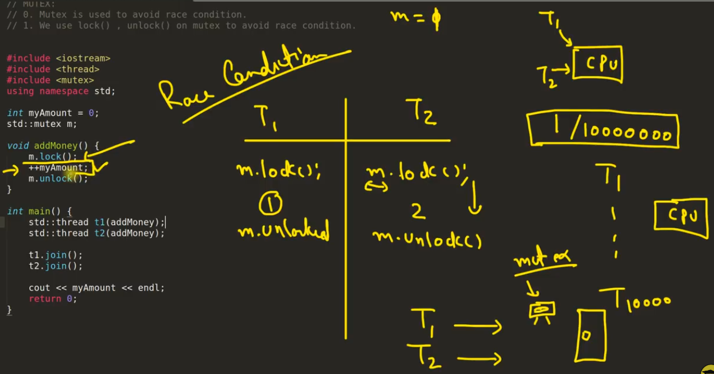

__NOTE : mtx.lock() is a blocking operation.__

## TOPIC: std::mutex::try_lock() On Mutex In C++11 Threading
    
0. try_lock() Tries to lock the mutex. Returns immediately. On successful lock acquisition returns true otherwise returns false.

1. If try_lock() is not able to lock mutex, then it doesn't get blocked that's why it is called non-blocking.

2. If try_lock is called again by the same thread (double try_lock) which owns the mutex, the behavior is undefined.
It is a dead lock situation with undefined behaviour. (if you want to be able to lock the same mutex by same thread more than one time then go for recursive_mutex)

There are so many try_lock function
1. std::try_lock
2. std::mutex::try_lock
3. std::shared_lock::try_lock
4. std::timed_mutex::try_lock
5. std::unique_lock::try_lock
6. std::shared_mutex::try_lock
7. std::recursive_mutex::try_lock
8. std::shared_timed_mutex::try_lock
9. std::recursive_timed_mutex::try_lock

Using std::mutex::try_lock(), the counter is having different value at different runs and not summing up to 2lakh. Reason: 1) CPU taking time to assigning lock(). 2) mutex::try_lock() is non-blocking, it tries to check lock() and skip it if its busy.  
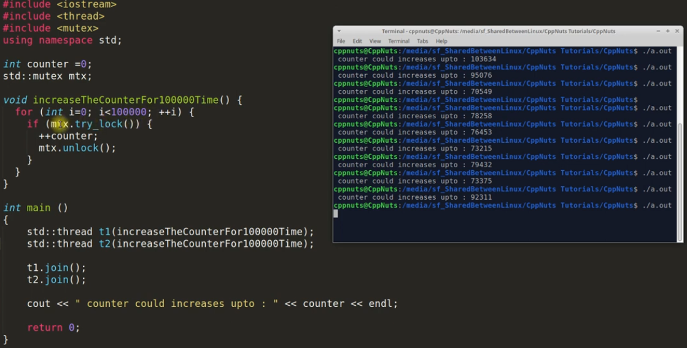

## TOPIC: std::try_lock() On Mutex In C++11 Threading

0. std::try_lock() tries to lock all the mutexes passed in it one by one in given order.
1. On success this function returns -1 otherwise it will return 0-based mutex index number which it could not lock.
2. If it fails to lock any of the mutex then it will release all the mutex it locked before.
3. If a call to try_lock results in an exception, unlock is called for any locked objects before rethrowing.

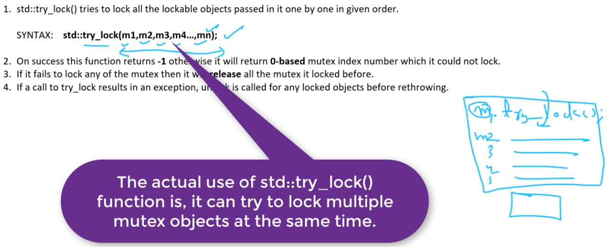

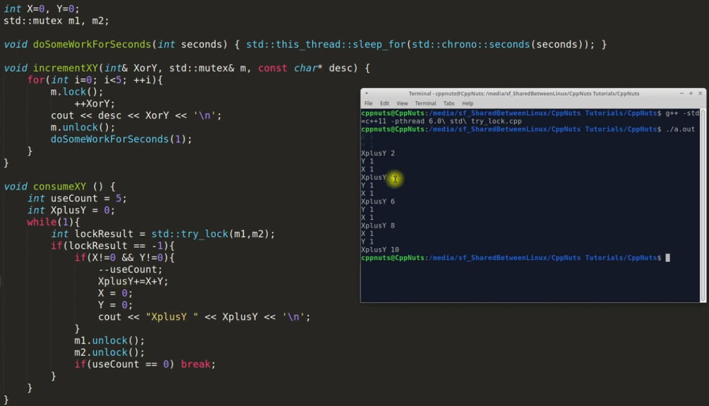

## TOPIC: Timed Mutex In C++ Threading (std::timed_mutex)

0. std::timed_mutex is blocked till timeout_time or the lock is aquired. Returns true if success otherwise false.

1. Member Function: (two functions)
   a. try_lock_for    
   b. try_lock_until  

EXAMPLE: try_lock_for();
Waits until specified timeout_duration has elapsed or the lock is acquired, whichever comes first.
On successful lock acquisition returns true, otherwise returns false.
```
int myAmount = 0;
std::timed_mutex m;

void increment(int i) {
 	if(m.try_lock_for(std::chrono::seconds(2))){
		++myAmount;
		std::this_thread::sleep_for (std::chrono::seconds(1));
		cout << "Thread " << i << " Entered" << endl;
		m.unlock();
	}else{
		cout << "Thread " << i << " Couldn't Enter" << endl;
	}
}

```

EXAMPLE: try_lock_until
Waits until specified timeout_time has been reached or the lock is acquired, whichever comes first.
On successful lock acquisition returns true, otherwise returns false.

```
int myAmount = 0;
std::timed_mutex m;

void increment(int i) {
	auto now=std::chrono::steady_clock::now();
	if(m.try_lock_until(now + std::chrono::seconds(2))){
		++myAmount;
		std::this_thread::sleep_for (std::chrono::seconds(1));
		cout << "Thread " << i << " Entered" << endl;
		m.unlock();	
	}else{
		cout << "Thread " << i << " Couldn't Enter" << endl;
	}
}

```

## TOPIC: Recursive Mutex In C++ (std::recursive_mutex)
 
NOTES:

0. It is same as mutex but, Same thread can lock one mutex multiple times using recursive_mutex.

1. If thread T1 first call lock/try_lock on recursive mutex m1, then m1 is locked by T1, now 
   as T1 is running in recursion T1 can call lock/try_lock any number of times there is no issue.

2. But if T1 have aquired 10 times lock/try_lock on mutex m1 then thread T1 will have to unlock
   it 10 times otherwise no other thread will be able to lock mutex m1.
   It means recursive_mutex keeps count how many times it was locked so that many times it should be unlocked.

3. How many time we can lock recursive_mutex is not defined but when that number reaches and if we were calling
   lock() it will return std::system_error OR if we were calling try_lock() then it will return false.

 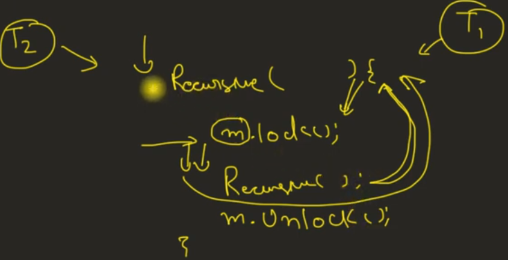  

  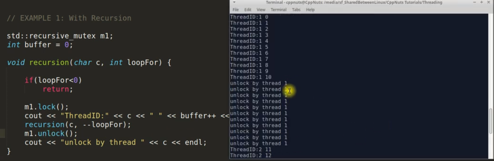  


  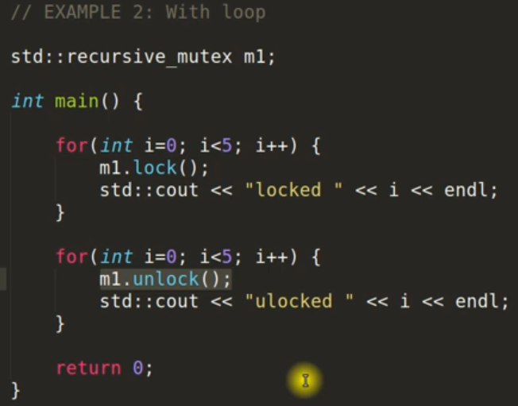  

BOTTOM LINE:

0. It is similar to mutex but have extra facitility that it can be locked multiple time by same thread.
1. If we can avoid recursive_mutex then we should becuase it brings overhead to the system.
2. It can be used in loops also.


# TOPIC: lock_guard In C++ (std::lock_guard<mutex> lock(m1))

NOTES:

0. It is very light weight wrapper for owning mutex on scoped basis.

1. It aquires mutex lock the moment you create the object of lock_guard.

2. It automatically removes the lock while goes out of scope. (destructor unlocks the lock_guard)

3. You can not explicitly unlock the lock_guard.

4. You can not copy lock_guard. (The lock dies with scope end.)

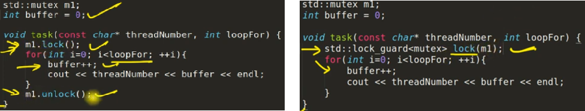 


# TOPIC: unique_lock In C++ (std::unique_lock<mutex> lock(m1))

NOTES:

1. The class unique_lock is a mutex ownership wrapper.

2. It Allows:

   a. Can Have Different Locking Strategies

   b. time-constrained attempts at locking (try_lock_for, try_lock_until)
   
   c. recursive locking
   
   d. transfer of lock ownership (move not copy)
   
   e. condition variables. (See this in coming videos)

**Locking Strategies**

| Sl. No. |  TYPE     | Effects |
|:-----|:--------:|------:|
| L0   | defer_lock   | do not acquire ownership of the mutex. |
| L1   | try_to_lock  |   try to acquire ownership of the mutex without blocking. |
| L2   | adopt_lock   |    assume the calling thread already has ownership of the mutex. |

Unique_lock same as lock_guard
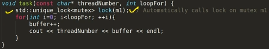 

Defer_lock example - Here we declared the lock but it the mutex happens when we call **lock()**
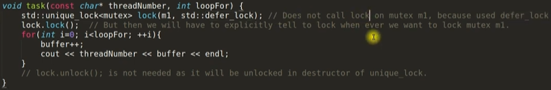 

# TOPIC: Condition Variable In C++ Threading

- CV are used for two purposes: 

  A. Notify other thread
  
  B. Waiting for some conditions

- Condition variable allows running threads to wait on some conditions and once those conditions are met the waiting thread is notified using: 
    
    a. notify_one()
    
    b. notify_all()

- You need mutex to use condition variable.
- For threads to wait on some condition then: 
    1. Acquire the mutex lock using std::unique_lock<mutex>
lock(m)
    2. Execute wait , wait_for, or wait_until.  The wait operations atomically release the mutex and suspend the execution of the thread.
    3. When the condition varibale is notified, the thread is awakened, and the mutex is atomically reacquired. The thread should then check the condition and resume waiting if the wake up was spurious.


NOTES:
1. Condition variable is used to synchronize two or more threads.
2. Best use case of condition variable is Producer/Consumer problem.
