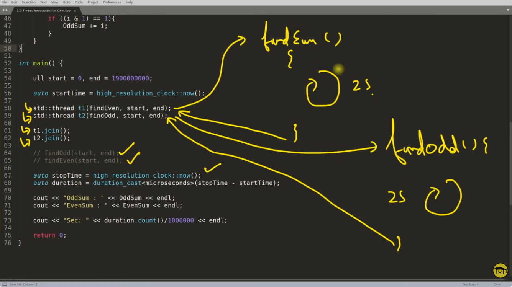
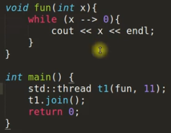
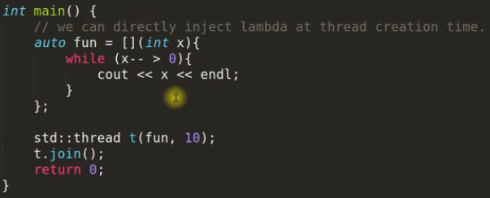
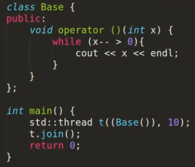
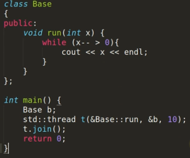
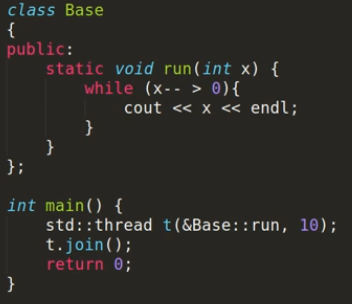
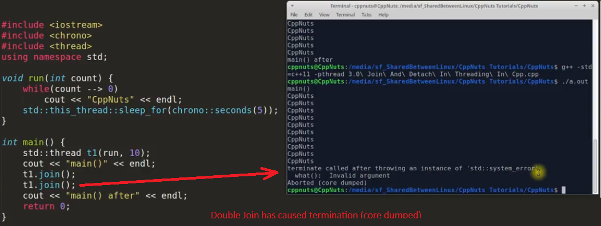
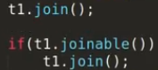
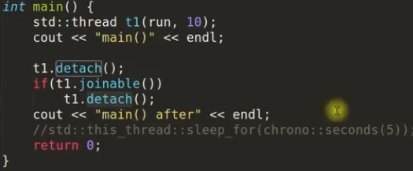
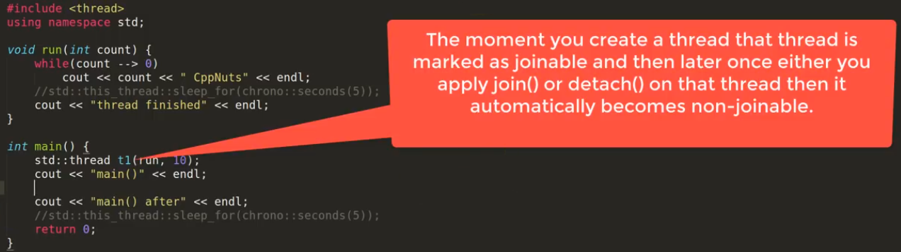

# C++ Threading 

Threading concept discussed here are relavent to C++ language. It is different from OS.
# TOPIC: Introduction to thread in c++ (c++11)   00 cpp file

- QUESTIONS
    1. What do you understand by thread and give one example in C++?
- ANSWER

    0. In every application there is a default thread which is main(), in side this we create other threads.
    1. A thread is also known as lightweight process. Idea is to achieve parallelism by dividing a process into multiple threads. 
    For example:
    (a) The browser has multiple tabs that can be different threads. 
    (b) MS Word must be using multiple threads, one thread to format the text, another thread to process inputs (spell checker)
    (c) Visual Studio code editor would be using threading for auto completing the code. (Intellicence)

- WAYS TO CREATE THREADS IN C++11
    1. Function Pointers
    2. Lambda Functions
    3. Functors
    4. Member Functions
    5. Static Member functions 

- Example of Function Pointers using std:thread  -> Check code    

# TOPIC: Different Types Of Thread Creation And Calling. 01 cpp file

There are 5 different types of creating threads in C++11 using **callable Objects**. 

** Note : If we create mulitple threads at the same time it doesn't guarantee which one will start first. **

1. Function Pointer : this is the very basic form of creating threads.

2. Lambda Function

3. Functor (Function Object)  : Class overloading the operator ()

4. Member function (Non_static member function) : Call a class function (non-static) using the class object. 

5. Static member function : Directly call the static memmber function.

# TOPIC: Use Of join(), detach() and joinable() In Thread In C++ (C++11)   02 cpp file

- JOIN NOTES
    
    0. Once a thread is started we wait for this thread to finish by calling join() function on thread object.
    1. Double join will result into program termination.
    2. If needed we should check thread is joinable before joining. ( using joinable() function)

good Cosing practicve : Joinable is a function that is used to check if the thread is joinable.

- DETACH NOTES
    
    0. This is used to detach newly created thread from the parent thread.
    1. Always check before detaching a thread that it is joinable otherwise we may end up double detaching and 
    double detach() will result into program termination.
    2. If we have detached thread and main function is returning then the detached thread execution is suspended.

- NOTES:
 
 Either join() or detach() should be called on thread object, otherwise during thread object's destructor it will 
 terminate the program. Because inside destructor it checks if thread is still joinable() if yes then it terminates the program.

